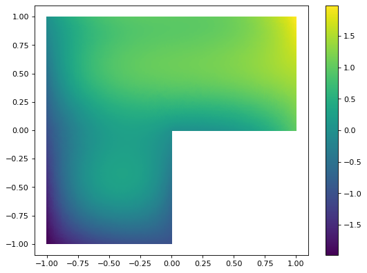

# Numerical Approximation of the Stationary Reaction Diffusion Equation on L-shape Domain

This is a part of my final project of the course Computational Methods for Engineering Applications that I finished in my fifth semester. The goal of the project was to solve the stationary reaction diffusion equation on a L-shape domain, which is why a FEM-approach instead of a finite difference approach was chosen.

The differential equation reads:

$$
-\nabla(\sigma \nabla u) + ru = f(x) \ \text{in} \ \Omega \subset \mathbb{R}^2 \\
u(x) = g(X) \ \text{on} \ \partial \Omega
$$

The code allows for different functions \\(\sigma\\), \\(f\\) and boundary conditions \\(g\\) to be implemented. The plot on the left results when choosing

$$
\sigma(x,y) = 0.01 (x+2)^2, \\
f(x,y)=\sin(\pi y)^2, \\
r = 0.5, \\
g(x,y)=x^3+y.
$$

[[GITHUB REPO]](https://github.com/vbjan/2d-FEM_on_L-shape_domain)

___

[< back](../index.html)
