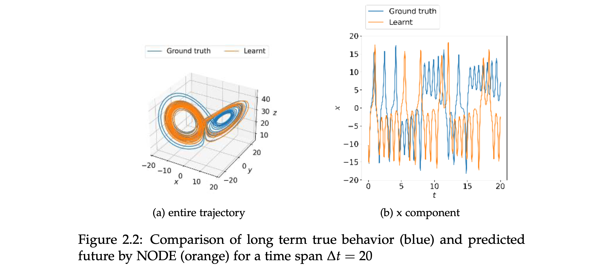

# Learning Residual Neural ODE Dynamics of Partially and Fully Observed Systems
*Bachelor thesis, May 14, 2021* \
*Keywords: machine learning, computational science*

Learning the underlying dynamics of a dynamical system provided measurement data is an important problem in a number of scientific fields. Chaotic systems are particularly difficult to learn in this context as they are inherently unpredictable for long time horizons.

In this thesis we explore the application of neural ordinary differential equations (NODEs) to learning the dynamics of such chaotic systems in different problem scenarios. NODEs are a novel family of neural network architectures that learn an underlying ordinary differential equation (ODE) of the observed dynamics provided data from the evolution of the fully or partially observed state of the system even at irregular time steps.

We focused on the application of NODEs to learn the behavior of chaotic systems from full state observations, partial state observations and full state observations with prior knowledge of the dynamics. We present a comprehensive study on applying NODEs as a data driven approach to learn the dynamics of chaotic systems.

[[DOWNLOAD THESIS]](../assets/docs/project_downloads/BachelorThesis-9.pdf.zip)

[[GITHUB REPO]](https://github.com/vbjan/Chaos_NeuralODE)

---
[< back ](../index.html)
