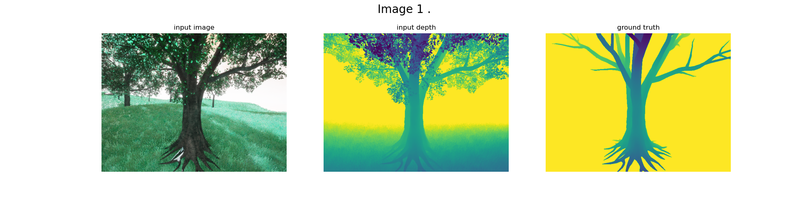
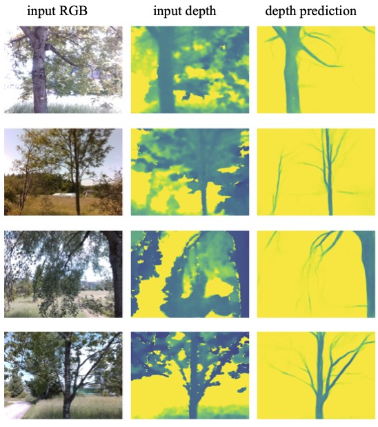

# Tree Branch Detection
*Keywords: computer vision, deep learning, domain adaption*

In this project, as part of the *Data Science Lab* course at ETH, we were challenged to predict a leafless depth mask of a tree that is observed with a RGB-D camera. So to break it down:

**Input:**
- RGB image of tree
- Depth mask of tree

**Target:**
- Depth mask of the same tree as if it had no leaves.

As it would be infeasible to create a dataset with such input and target pairs in the real world, we opted to create it in simulation, to be able to train a supervised model. The images below show an example pair from the simulated dataset.

During this project we experimented with a number of models ranging from generative models to typical segmentation networks. In the end it turned out that adapting common segmentation networks to perform depth prediction and training them in a supervised, end-to-end fashion yielded the best performance. Below you can find some example predictions on real data. Note that the model has only been trained on synthetic data! (with domain adaption)

By taking a video with a RGB-D camera, performing frame wise predictions and turning them in to a gif, we can visualize the interpretation the model has of a given tree. The input to the model is on the left side, while the prediction is on the right.

*Full report will be added later*

___

[< back](../index.html)
